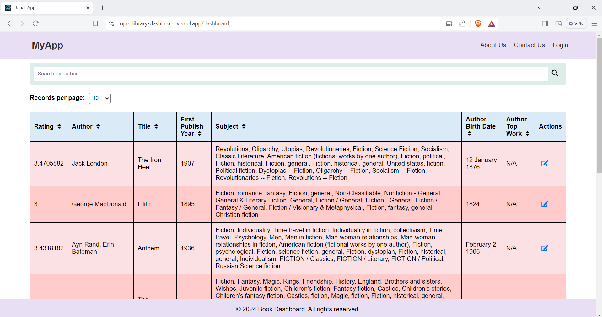

# **Admin Dashboard**

## **Description**

The Admin Dashboard is a web application built to display book records fetched from the Open Library API in a tabular format. It provides various features such as pagination, sorting, searching, and editing of row entries. Additionally, users can download the current results in a CSV format.

## **Features**

- Display book records from the Open Library API
- Pagination support with customizable records per page
- Ability to apply ascending/descending sort on all columns
- Search books feature by author
- Editable row entries
- Download current results in CSV format
- Authentication for logging into the dashboard
- Hosted online for easy access

## **Technologies Used**

- **Frontend:** ReactJS
- **UI Framework:** Material-UI
- **State Management:** React Hooks
- **HTTP Client:** Axios
- **CSV Export:** react-csv
- **Authentication:** Firebase Auth
- **Hosting:** Vercel

## **Installation**

1. Clone the repository:
- git clone https://github.com/BhavanaAtGit/Openlibrary-Dashboard.git

2. Install dependencies:
- cd admin-dashboard
- npm install

3. Start the development server:
- npm start

## **Usage**

1. Log in with your credentials (if authentication is enabled).
2. Navigate to the dashboard URL.
3. Explore the dashboard features:
- View book records
- Sort columns
- Search books by author
- Edit row entries
- Download results in CSV

